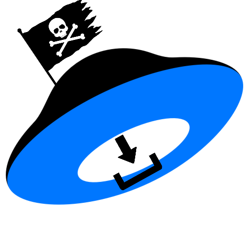

# Яндекс.Диск Downloader (Alpha)

 <!-- Поместите свой логотип в docs/ -->

[](https://github.com/LencoDigitexer/yadisk-dl/releases)
[](https://github.com/LencoDigitexer/yadisk-dl/actions)
[](https://www.python.org/)
[](LICENSE)

Утилита для массовой загрузки фото с Яндекс.Диска из безлимитного хранилища

## 📦 Установка

1. Клонируйте репозиторий:

```bash
git clone https://github.com/LencoDigitexer/yadisk-dl.git
cd yadisk-dl
```

2. Установите зависимости:

```bash
pip install -r requirements.txt
```

## 🚀 Использование

1. **Авторизация** (создает session.pkl):

```bash
python src/00auth.py
```

2. **Сбор ссылок** (сохраняет в links.db):

```bash
python src/01getlinks.py
```

3. **Загрузка файлов** (в папку downloads/):

```bash
python src/02download.py
```

## 🔧 Зависимости

- Selenium - автоматизация браузера
- Requests - HTTP-запросы
- TQDM - прогресс-бар
- SQLite3 - хранение ссылок

## 🖥️ Сборка в exe (автоматически в релизах)

```bash
pyinstaller --onefile --clean --name=ya_auth src/00auth.py
pyinstaller --onefile --clean --name=ya_getlinks src/01getlinks.py
pyinstaller --onefile --clean --name=ya_download src/02download.py
```

## ⚠️ Ограничения

- Требуется ручная авторизация
- Поддерживается только Яндекс.Диск

## 🤝 Участие в проекте

1. Форкните репозиторий
2. Создайте ветку: `git checkout -b feature/new-feature`
3. Сделайте коммиты
4. Отправьте PR в `main` ветку

## 📄 Лицензия

AS IS. Подробнее в файле [LICENSE](LICENSE)
